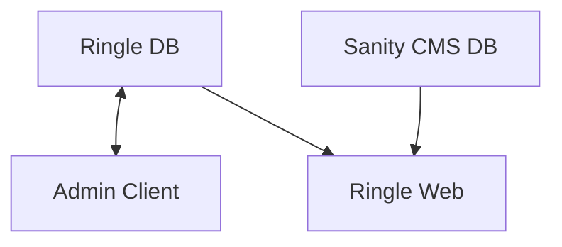
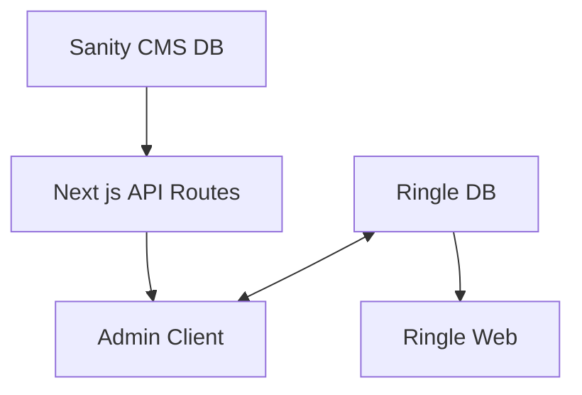

AS-IS

현재 3.0 교재 상세 페이지에서 인사이트 데이터를 불러오는 방식은 다음과 같습니다. 먼저, 링글 어드민에서 교재 데이터를 생성하면 이 데이터를 링글 웹에서 표시하고, 해당 교재의 아이디와 일치하는 교재 인사이트 데이터를 Sanity CMS에서 따로 불러옵니다. 결과적으로 링글 웹 클라이언트에서는 두 번의 API 호출을 수행하고 있는 것입니다.

TO-BE

교재 데이터를 생성할 때, CMS에서 인사이트 내용을 입력하지 않거나 적절한 교재 아이디를 입력하지 않는 실수를 방지하기 위해 Admin Client에서 Next.js API를 사용하여 인사이트 데이터를 불러와서 교재 데이터와 함께 생성하려 합니다. 인사이트 데이터는 배열 형태로 저장하면 됩니다. 또한 교재 데이터에 인사이트 데이터가 없는 경우 교재 데이터를 생성하지 못하도록 하여 실수를 줄일 수 있을 것입니다.